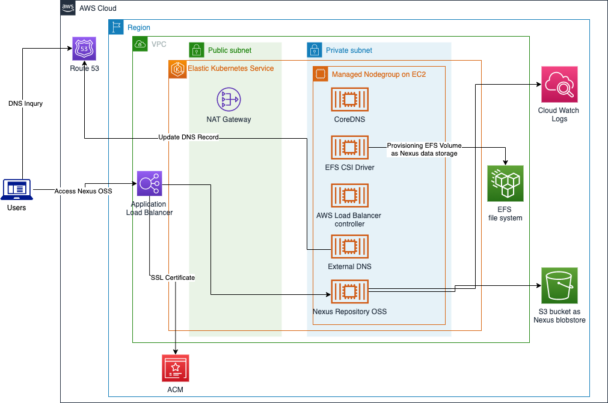

# Sonatype Nexus OSS on Amazon EKS

Deploy Sonatype Nexus3 via Helm on EKS.

- Use EFS via EFS CSI driver, PV and PVC as Nexus3 data storage
- Create a dedicated S3 bucket as Nexus3 blobstore
- Use external DNS to create record in Route53 for ingress domain name 
- Use ACM to get certificate of domain name

## Architecture diagram


## Usage

### Prerequisites
- An AWS account
- Nodejs LTS installed, such as 12.x or 14.x
- A public hosted zone in Route53(optional)
- Has default VPC with public and private subnets cross two available zones at least, NAT gateway also is required
- Install dependencies of app  
```
npm run init
```

### Deployment
#### Deploy to EKS with managed EC2 nodes
```
npm run deploy -- --parameters domainName=<the hostname of nexus3 deployment>
```

#### Deploy with Route53 managed domain name
```
npm run deploy -- --parameters domainName=<nexus.mydomain.com> -c r53Domain=<mydomain.com>
```
or
```
npm run deploy -- --parameters domainName=<nexus.mydomain.com> --parameters r53HostedZoneId=<id of route53 hosted zone> -c enableR53HostedZone=true
```

#### Deploy to a new created VPC
```
npm run deploy -- -c createNewVpc=true
```

#### Deploy to China regions
Due to AWS load balancer has different policy requirement for partitions, you need speicfy the target region info via context `region` to pick the corresponding IAM policies.
```
npm run deploy -- -c region=cn-north-1
```

### Default login
Check [installation guide of Helm chart sonatype-nexus](https://github.com/Oteemo/charts/tree/master/charts/sonatype-nexus#installing-the-chart)

### Auto configuration
Nexus3 supports using [script][nexus3-script] to configure the Nexus3 service, for example, BlobStores, Repositories and so on. The script feature is disabled by default since Nexus3 3.21.2. You can opt-in auto configuration feature of this solution like below that will enable script feature of Nexus.
```
npm run deploy -- -c enableAutoConfigured=true
```
It would automatically configure the fresh provisioning Nexus3 with below changes,

- Delete all built-in repositories
- Delete default `file` based blobstore
- Create a new blobstore named `s3-blobstore` using the dedicated S3 bucket created by this solution with never expiration policy for artifacts

### How to clean
Run below command to clean the deployment or delete the `SonatypeNexus3OnEKS` stack via CloudFormation console.
```
npm run cleanup
```
**NOTE**: you still need manually delete the EFS file system and S3 bucket created by this solution. Those storage might contain your data, be caution before deleting them.

## Security

See [CONTRIBUTING](CONTRIBUTING.md#security-issue-notifications) for more information.

## License

This library is licensed under the MIT-0 License. See the LICENSE file.

Also this application uses below open source projects,

- [Nexus OSS](https://github.com/sonatype/nexus-public)
- [travelaudience/kubernetes-nexus](https://github.com/travelaudience/kubernetes-nexus/) 
- [Oteemo/charts](https://github.com/Oteemo/charts)
- [AWS Load Balancer Controller](https://github.com/kubernetes-sigs/aws-load-balancer-controller)
- [EKS Charts](https://github.com/aws/eks-charts)
- [aws-efs-csi-driver](https://github.com/kubernetes-sigs/aws-efs-csi-driver)
- [external-dns](https://github.com/kubernetes-sigs/external-dns)
- [nexus3-cli](https://gitlab.com/thiagocsf/nexus3-cli)

[nexus3-script]: https://help.sonatype.com/repomanager3/rest-and-integration-api/script-api